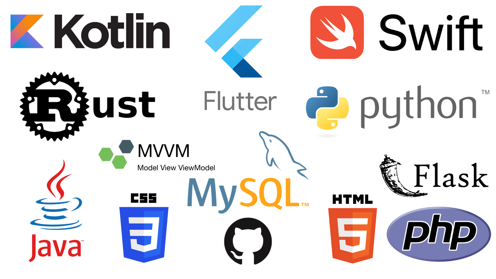

### Welcome to my profile page 🔭, where ideas come to life! I hope you find my content helpful and engaging. Please feel free to explore and reach out to me if you have any questions or just want to chat. Thanks for stopping by!

<!--
**dilipkumar4813/dilipkumar4813** is a ✨ _special_ ✨ repository because its `README.md` (this file) appears on your GitHub profile.

Here are some ideas to get you started:

- 🔭 I’m currently working on ...
- 🌱 I’m currently learning ...
- 👯 I’m looking to collaborate on ...
- 🤔 I’m looking for help with ...
- 💬 Ask me about ...
- 📫 How to reach me: ...
- 😄 Pronouns: ...
- ⚡ Fun fact: ...
-->

# About Me

Dilip Kumar is the Head of Technology at Fireworks Solutions Sdn Bhd. He has a broad range of experience working on various projects in different domains, including loyalty programmes, cryptocurrency, eCommerce, residential apps, and travel applications. Dilip has particular expertise in team building, setting up application architectures, client liaison, and leading end-to-end software development. He is a highly skilled leader who has successfully managed multifarious projects.

## Skills

<!--  -->

Multi-skilled developer with experience in a wide range of programming languages and technologies. They are proficient in developing iOS applications using Swift, as well as Android applications using Kotlin. Additionally, they have experience with cross-platform development using Flutter. Has a strong background in backend development, including expertise in PHP, Python, Java, and Rust. They also have experience in database development using MySQL, as well as cloud computing using AWS and Google Cloud. Finally, this person has knowledge in web development technologies like HTML and CSS. Overall, a versatile and highly skilled technologist with a diverse set of skills that allows me to tackle various projects across multiple platforms and technologies.

## Some of my projects

### Poh Kong :iphone:
1. [iOS Link](https://apps.apple.com/sg/app/poh-kong-jeweland/id1490755060)
1. [Android Link](https://play.google.com/store/apps/details?id=my.fireworks.pohkong&hl=en&gl=US)

### SOGO
1. [iOS Link](https://apps.apple.com/my/app/mysogo/id1213284062)
2. [Android Link](https://play.google.com/store/apps/details?id=com.incredibleqr.mysogo&hl=en&gl=US)

### Avenue K
1. [iOS Link](https://apps.apple.com/ng/app/avenue-k/id1502547158)

### Atria
1. [iOS Link](https://apps.apple.com/my/app/atria/id1437137050)
1. [Android Link](https://play.google.com/store/apps/details?id=my.fireworks.atria&hl=en&gl=US)

### Recruit4Rewards
1. [iOS Link](https://apps.apple.com/us/app/recruit4rewards/id1574454836)
1. [Android Link](https://play.google.com/store/apps/details?id=com.fireworks.jump_retail)
